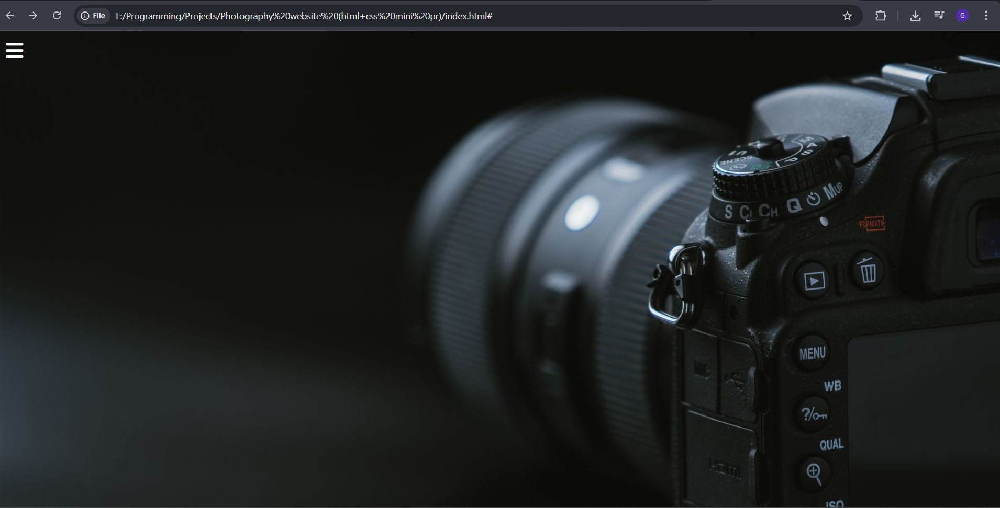
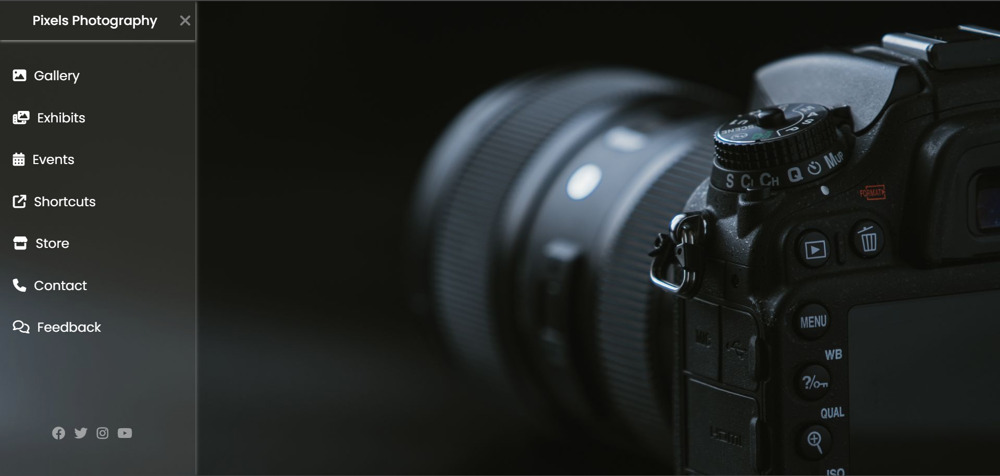
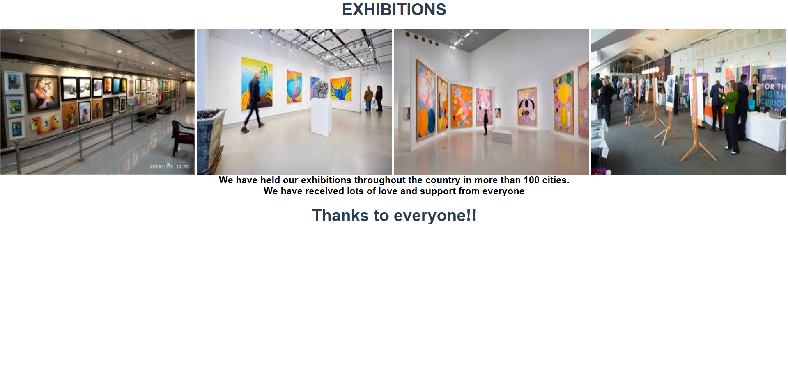
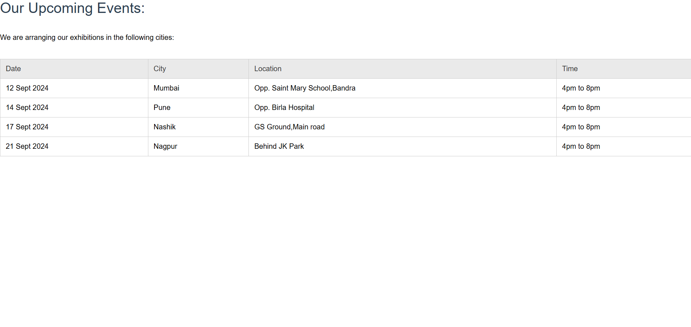

# Sidebar Navigation Website

This is my **first web project** built using only **HTML** and **CSS**. It features a responsive sidebar navigation menu with links to multiple static pages like Gallery, Exhibits, Events, and more.

---

## 🚀 Features

- Responsive Sidebar Navigation
- Clean UI with Font Awesome Icons
- Google Fonts Integration
- Multiple HTML Pages:
  - `index.html`
  - `gallery.html`
  - `exhibits.html`
  - `events.html`
- CSS-only toggleable sidebar
- Image-based gallery & exhibition sections

---

## 📂 Project Structure

```
├── index.html
├── gallery.html
├── exhibits.html
├── events.html
├── style.css
├── photo.jpg
├── /images
│   ├── imgage1.jpg
│   ├── imgage2.jpg
│   └── ...
```
---

## 📸 Screenshots

### 🏠 Home Page


### 📂 Sidebar Menu Open


### 🖼️ Gallery Page


### 🖌️ Exhibits Page


### 📅 Events Page


---

## 🌐 Live Demo 

👉 [Click here to view live demo] ()

---

## 🙋‍♀️ Author

**Gauri Patil**  
Learning HTML, CSS & Full Stack Web Development 🌐

---

## 📄 License

This project is for learning purposes. Free to use or improve!
